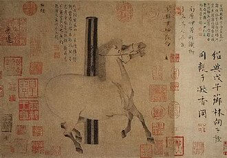

_A reflection on historical memory, timelines, and the strange experience of placing lives, events, and ideas beside one another across centuries._

## What is a Book of Centuries?

## Lives alongside lives: the compression of history

## Connecting people, events, and ideas

## Why I keep one, how, and where

---

[1] - 

[2] - 