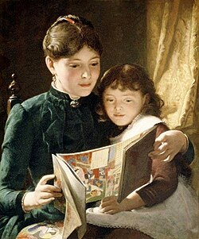

_On creating the type of environment necessary for the learner to thrive: the ambiance for deep thought, and the atmosphere for creativity and synthesis._

## The environment is always teaching us

## Creating the conditions for curiosity

## Learning as a way of life

## The atmosphere I hope to build

---

[1] - 

[2] - 