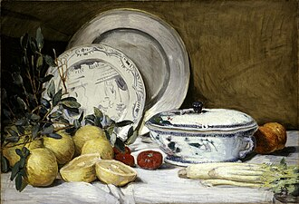

_A catalog of useful, beloved, ordinary objects that quietly gather meaning through everyday use._

## The things I reach for every day

## Objects with histories

## Objects that changed how I live

## A small museum of ordinary life

---

[1] - 

[2] - 