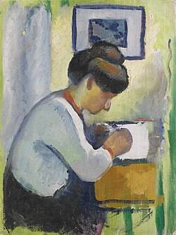

_The gradual rebuilding of a writing practice over time. How I got myself back into writing - and how I'm still doing so today._

## For the love of writing

## I haven't written all that much yet

## At least not as much as I'd like

## I started again, slowly

## I'm taking it day by day

---

[1] - 

[2] - 
