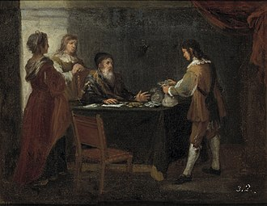

_Notes on inheritance beyond genetics: books, habits, songs, recipes, stories, educational values, emotional patterns, and ways of seeing the world._

## Something to leave behind

## Pulling examples from my own inheritance

## The contents of a legacy

## Putting together a hope chest

---

[1] - _El hijo pródigo recoge su legítima_ by Bartolomé Esteban Murillo
https://www.museodelprado.es/coleccion/obra-de-arte/el-hijo-prodigo-recoge-su-legitima/35803c3a-b20a-41ac-a3bd-20947926ec54

[2] -