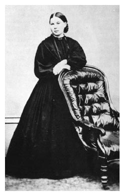

_Notes on Charlotte Mason's philosophy of education, including living books, narration, atmosphere, habit formation, and the cultivation of a rich intellectual life._

## About the Book

## Key Ideas

## Notes and Quotations

## Questions and Reflections

## Connections
