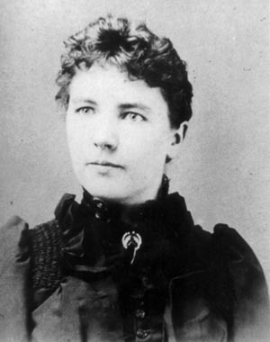

_Notes on The Little House books, their vision of family life, work, self-reliance, childhood, and the rhythms of a household shaped by the seasons._

## About the Series

## Key Ideas

## Notes and Quotations

## Questions and Reflections

## Connections
